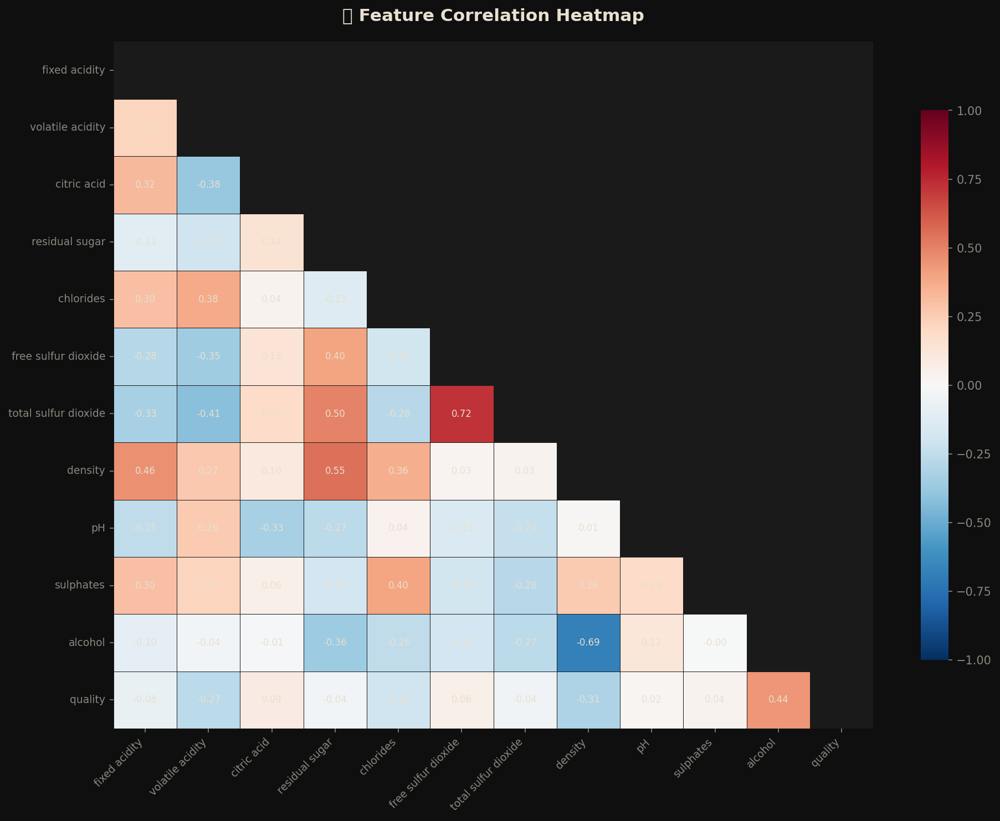
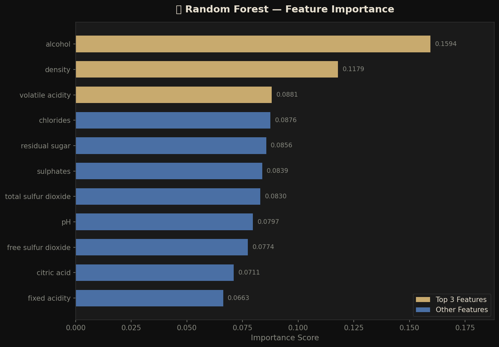
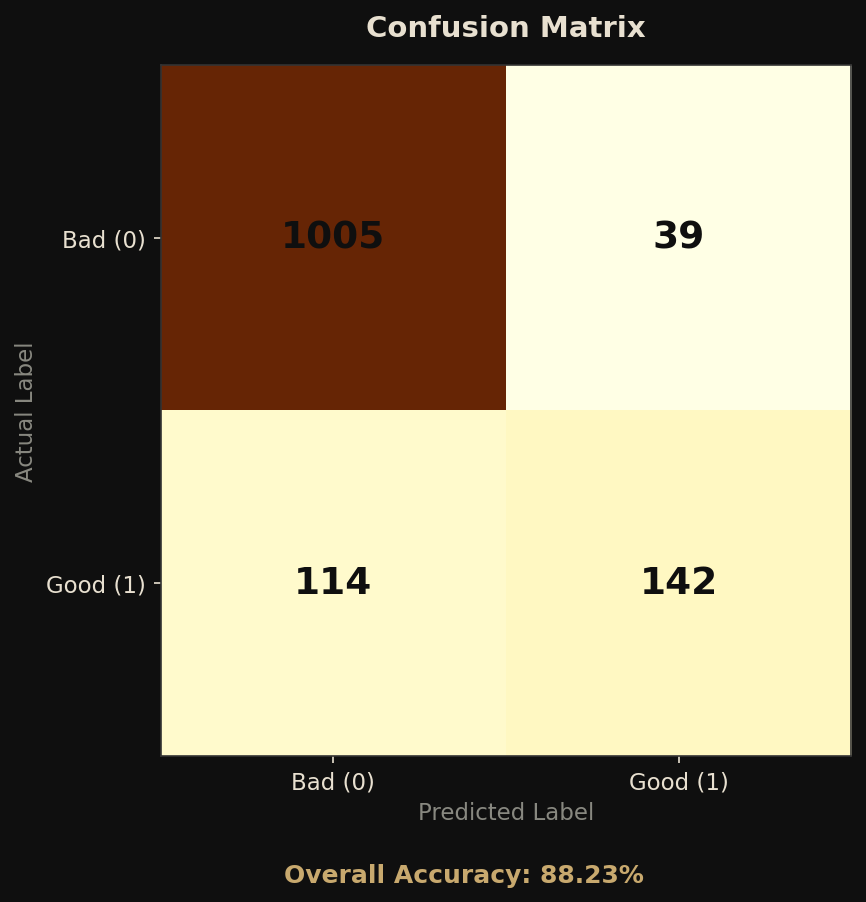

# 🍷 Wine Quality Prediction

> A beginner-friendly Machine Learning project that predicts wine quality using physicochemical properties. Built with Python, Scikit-Learn, and Streamlit.


---

## 📌 Project Overview

This project uses a dataset of red and white wines to predict whether a wine is **good** or **bad quality** based on its physicochemical properties (acidity, sugar, alcohol, etc.).

The goal is to demonstrate a clean, end-to-end Machine Learning workflow — from raw data to a deployed prediction app.

### 🎯 What This Project Covers
- Exploratory Data Analysis (EDA)
- Feature correlation and distribution analysis
- Binary classification (Good / Bad quality)
- Model comparison: Logistic Regression vs Random Forest
- Model evaluation with accuracy, confusion matrix, and classification report
- Saved model deployment via Streamlit

---

## 📊 Dataset Overview & Context

This project uses the public **Portuguese "Vinho Verde" Wine Dataset**, tracking physicochemical tests and sensory expert data from variants in the north of Portugal. 

- **Source:** [UCI Machine Learning Repository — Wine Quality Dataset](https://archive.ics.uci.edu/ml/datasets/wine+quality) (Cortez et al., 2009).
- **Data Volume:** Combines **1,599** red wine samples and **4,898** white wine samples for a grand total of **6,497** rows.
- **Data Integrity:** Highly clean dataset with **zero missing values** (None).

Here is the chemical dictionary of the columns predicting the final sensory outcome:

| Feature | Description |
|---|---|
| `fixed acidity` | Tartaric acid concentration |
| `volatile acidity` | Acetic acid (too much = vinegar taste) |
| `citric acid` | Freshness and flavor |
| `residual sugar` | Sugar remaining after fermentation |
| `chlorides` | Salt content |
| `free sulfur dioxide` | Protects wine from oxidation |
| `total sulfur dioxide` | Total SO₂ bound + free |
| `density` | Depends on alcohol and sugar content |
| `pH` | Acidity scale (lower = more acidic) |
| `sulphates` | Additive for antimicrobial purposes |
| `alcohol` | Percentage of alcohol by volume |
| `quality` | Score between 0–10 (target variable) |

**Label Engineering:** Quality ≥ 7 → `Good (1)`, Quality < 7 → `Bad (0)`

---

## 🗂️ Project Structure

```
wine-quality-prediction/
│
├── data/
│   ├── winequality-red.csv          ← Raw red wine dataset
│   ├── winequality-white.csv        ← Raw white wine dataset
│   ├── winequality.names            ← Dataset description file
│
├── notebooks/
│   └── wine_quality_analysis.ipynb  ← Interactive EDA and ML walkthrough
│
├── src/
│   ├── preprocess.py                ← Data cleaning and feature scaling
│   ├── train.py                     ← Model training and saving
│   ├── evaluate.py                  ← Metrics, plots, and model comparison
│   └── predict.py                   ← Predict quality for new wine samples
│
├── models/
│   └── wine_quality_model.pkl       ← Saved best-performing model
│
├── images/
│   ├── heatmap.png                  ← Feature correlation heatmap
│   ├── confusion_matrix.png         ← Confusion matrix visualization
│   └── feature_importance.png       ← Random Forest feature importance
│
├── app.py                           ← Streamlit prediction web app
├── requirements.txt                 ← Python dependencies
├── .gitignore                       ← Files excluded from version control
└── README.md                        ← Project documentation (you're here!)
```

---

## ⚙️ Setup & Installation

### 1. Clone the Repository
```bash
git clone https://github.com/rapfii/wine-quality-prediction
cd wine-quality-prediction
```

### 2. Create a Virtual Environment *(Recommended)*
```bash
# Windows
python -m venv venv
venv\Scripts\activate

# macOS / Linux
python3 -m venv venv
source venv/bin/activate
```

### 3. Install Dependencies
```bash
pip install -r requirements.txt
```

---

## 🚀 How to Run

### Option A — Run the Full ML Pipeline
```bash
# Step 1: Preprocess data
python src/preprocess.py

# Step 2: Train models
python src/train.py

# Step 3: Evaluate models
python src/evaluate.py

# Step 4: Make a prediction
python src/predict.py
```

### Option B — Explore the Notebook
```bash
jupyter notebook notebooks/wine_quality_analysis.ipynb
```

### Option C — Launch the Web App
```bash
streamlit run app.py
```
Then open your browser at: `http://localhost:8501`

---

## 📈 Pipeline Execution & Results

Running the full pipeline produces a comprehensive output across data processing, model training, evaluation, and live predictions. Below is the detailed breakdown of the project outcomes:

### 1. Data Preprocessing (`src/preprocess.py`)
- **Data Merging**: Automatically loads and combines the raw `winequality-red.csv` and `winequality-white.csv` into a unified dataset comprising **6,497 samples** and 12 columns.
- **Label Engineering**: Transforms the 0–10 `quality` score into a binary classification target: **Good (1)** for quality ≥ 7, and **Bad (0)** for all others.
- **Data Splitting & Scaling**: Splits the dataset into an 80% training set and a 20% test set. Applies `StandardScaler()` to standardize physicochemical feature magnitudes, saving the scaler configuration to `models/scaler.pkl` to guarantee identical scaling for unseen inputs.

### 2. Model Training (`src/train.py`)
- The script evaluates the performance of a base linear model against a robust tree-based model:
  - **Logistic Regression**: Achieved an accuracy of **~75%**.
  - **Random Forest Classifier**: Achieved a significantly higher accuracy of **~88.23%** ✅.
- **Model Serialization**: Random Forest is chosen as the final model due to its superior ability to capture complex, non-linear relationships in the chemical data. The finalized model is seamlessly exported to `models/wine_quality_model.pkl`.

### 3. Model Evaluation (`src/evaluate.py`)
- Outputs a detailed **Classification Report** explicitly emphasizing model robustness:
  - **Overall Accuracy:** 88.23%
  - **F1-Scores:** 0.93 for Bad quality wine and 0.65 for Good quality wine (reflecting the real-world scarcity/imbalance of high-tier wine samples).
- Automatically renders and saves crucial analytical graphics into the `images/` directory:
  - 🌡️ **Correlation Heatmap:** Maps pairwise linear relationships between physicochemical features.
  - 📋 **Confusion Matrix:** Illustrates the raw count of True Positives/Negatives vs. False Predictions.
  - 🌲 **Feature Importance:** Highlights that **Alcohol**, **Density**, and **Volatile Acidity** weigh the absolute heaviest when deciding a wine's quality.

### 4. Interactive Predictions (`src/predict.py` & `app.py`)
- **CLI Predictions:** The command-line script simulates raw backend functionality, validating unseen numerical samples against the loaded `.pkl` model and calculating the exact confidence percentage.
- **Streamlit Web Dashboard:** Running `streamlit run app.py` launches a responsive, cleanly styled graphical interface. It provides interactive sliders for all the chemical metrics, dynamically computing and displaying **real-time quality predictions** using the saved Machine Learning artifacts.

---

## 🖼️ Visualizations

| Correlation Heatmap | Feature Importance | Confusion Matrix |
|---|---|---|
|  |  |  |

---

## 🧠 ML Workflow

```
Raw Data → EDA → Feature Engineering → Scaling
    → Train/Test Split → Model Training
    → Evaluation → Best Model Saved → Prediction App
```

---

## 🛠️ Technologies Used

| Tool | Purpose |
|---|---|
| `pandas` | Data loading and manipulation |
| `numpy` | Numerical operations |
| `matplotlib` + `seaborn` | Data visualization |
| `scikit-learn` | ML models, scaling, evaluation |
| `joblib` | Model serialization (save/load) |
| `streamlit` | Web app for predictions |

---

## 📄 License

This project is licensed under the **MIT License** — feel free to use, modify, and share.

---

## 🙋 Author

**Your Name**
- GitHub: [@rapfii](https://github.com/rapfii)

---

> ⭐ If you found this project helpful, consider giving it a star!
